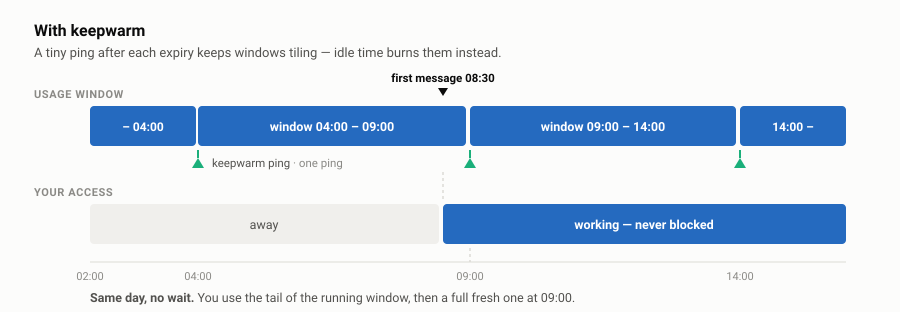

<div align="center">

# codex-keepwarm

**Stop waiting out your 5-hour window.**

The Codex CLI's usage window only starts when *you* do — so idle hours buy you
nothing. `keepwarm` keeps windows rolling around the clock, using the ChatGPT
subscription you already pay for.

[](https://github.com/alanrliu/codex-keepwarm/actions/workflows/ci.yml)
[](https://alanrliu.github.io/codex-keepwarm/)
[](LICENSE)


[**Documentation**](https://alanrliu.github.io/codex-keepwarm/) ·
[Install](https://alanrliu.github.io/codex-keepwarm/install/) ·
[How it works](https://alanrliu.github.io/codex-keepwarm/how-it-works/)

</div>

---

## The problem

Your 5-hour window starts at the **top of the hour containing your first
message**. It does not tick while you're away.


You were away for seven hours and still had to wait four more. Those idle hours
bought you nothing, because a window only starts when *you* start.

## The fix

`keepwarm` sends one tiny prompt just after each window expires, so windows tile
back to back whether you're at the keyboard or not.



You do **not** get more quota per window. You get **more windows per day** — up
to the natural ceiling of 24 ÷ 5 ≈ 4.8 — regardless of when you sit down.

> ### Read this before you install it
>
> ChatGPT plans meter Codex on **two** limits: the 5-hour window this tool
> tiles, and a **weekly** limit it cannot do anything about. On Plus the weekly
> limit is the one that actually binds — measured against the 5-hour window, the
> weekly allowance is worth only about three full windows, so you will run out
> of week long before you run out of windows.
>
> keepwarm still helps when your problem is *"my window hadn't started yet"*. It
> does nothing for *"I'm out of weekly credit"*, and the pings themselves draw
> on that same weekly budget. See
> [How it works](docs/how-it-works.md#two-limits-not-one).

## Install

Needs a logged-in [Codex CLI](https://developers.openai.com/codex/cli).

**macOS / Linux** — requires bash 3.2+ and `cron`:

```sh
git clone https://github.com/alanrliu/codex-keepwarm.git
cd codex-keepwarm

./keepwarm install     # hourly cron job
./keepwarm ping        # open the first window — sets your boundary phase
./keepwarm doctor      # confirm it's actually running
```

**Windows** — requires PowerShell 5.1 (ships with Windows) or 7:

```powershell
git clone https://github.com/alanrliu/codex-keepwarm.git
cd codex-keepwarm

.\keepwarm.ps1 install    # hourly scheduled task
.\keepwarm.ps1 ping       # open the first window
.\keepwarm.ps1 doctor     # confirm it's actually running
```

> **Use the native Windows port, not WSL.** WSL2 shuts its VM down once your
> last shell exits, so `cron` inside WSL won't fire overnight — exactly when the
> keepalive matters.

Both run **hourly** but only call Codex when the window has actually expired,
so a missed run self-corrects instead of drifting out of phase.

## Is it running?

You never have to wait for a ping to find out — every hourly tick writes a log
line even when nothing is due, so the log doubles as a heartbeat.

```
$ ./keepwarm doctor

  [ok]   codex binary           /home/you/.local/bin/codex
  [ok]   cron job               installed (fires at :02 every hour)
  [ok]   cron daemon            running
  [ok]   last tick              0h 08m ago — cron is firing
  [ok]   window tracked         2026-09-21 13:00 -> 2026-09-21 18:00

  next cron tick   2026-09-21 17:02 (in 0h 47m)
  that tick will   log a WAIT line and exit (no API call)
  first ping tick  2026-09-21 18:02 (in 1h 47m)

  5 ok, 0 warning(s), 0 failing
```

`doctor` exits non-zero when something's wrong, so it works as a health probe.
In the log, `WAIT` means the tick ran and correctly spent nothing; `OK` means a
window opened, and `AUTH` means your Codex login expired — sign in again with
`codex login`.

## Cost

Pings draw on the usage your ChatGPT subscription already includes — there's no
separate bill and nothing to enable. They are not free, though: a ping is a
normal `codex exec` turn, carrying Codex's own instructions and tool schemas,
and it spends a slice of both the 5-hour window and the weekly limit. The
numbers are in [How it works](docs/how-it-works.md#what-a-ping-costs).

> **The one exception:** if you've pointed Codex at an `OPENAI_API_KEY` instead
> of a ChatGPT login, those tokens are billed the usual way.

## Commands

| Command | What it does |
| --- | --- |
| `keepwarm install` | Install the hourly cron job / scheduled task |
| `keepwarm ping` | Open a window now — also **re-phases** your boundaries |
| `keepwarm doctor` | Health check: binary, schedule, daemon, heartbeat, window |
| `keepwarm status` | Current window, next ping, recent log |
| `keepwarm log [n]` | Last n log lines |
| `keepwarm uninstall` | Remove the schedule (add `--purge` to delete state and logs too) |

On Windows, use `.\keepwarm.ps1` in place of `./keepwarm`. Full command,
configuration and troubleshooting reference is
[in the docs](https://alanrliu.github.io/codex-keepwarm/reference/).

## Stopping it

```sh
./keepwarm uninstall            # stop it, keep your window state
./keepwarm uninstall --purge    # stop it and delete state and logs
```

> **Uninstall before deleting the folder.** Removing the directory does *not*
> remove the schedule — the cron entry or scheduled task survives, fires every
> hour forever, and fails silently. If you already deleted it:
> `crontab -l | grep -v codex-keepwarm | crontab -` on macOS/Linux, or
> `Unregister-ScheduledTask -TaskName codex-keepwarm -Confirm:$false` on
> Windows.

## Credits

A port of [claude-keepwarm](https://github.com/mamuncseru/claude-keepwarm) by
Md. Abdullah Al Mamun, adapted to the Codex CLI. The window model, the
self-correcting hourly tick and the test approach are all from that project.

An unofficial community tool, not affiliated with OpenAI. MIT licensed.
